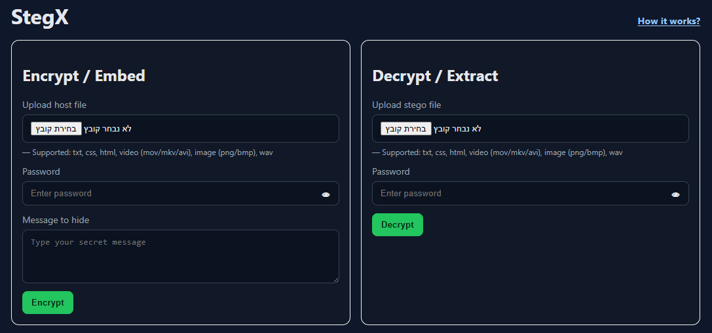

<div align="center">

# StegX

**Advanced Multi-Format Steganography System**

<h3>
  Holon Institute of Technology (HIT)
  <br>
  Semester B - 2025
</h3>

[](https://steganography-front.onrender.com/)
[](LICENSE)
[](https://www.python.org/)

<br />

<p align="center">
  <a href="https://steganography-front.onrender.com/">
    
  </a>
</p>

<h3>
  <a href="https://steganography-front.onrender.com/">View Live Demo</a>
  <span> | </span>
  <a href="#technical-architecture--algorithms">Algorithms</a>
  <span> | </span>
  <a href="#team-members">The Team</a>
</h3>

</div>

---

##  About The Project

**StegX** is a comprehensive steganography system developed as a dual-semester project at **HIT**. The goal was to build a tool capable of concealing information inside digital files in a way that is invisible to the naked eye and transparent to the operating system.

Unlike simple tools that only support images, StegX implements dedicated algorithms for **Video, Audio, Image, and Text** formats, ensuring the "container" file remains functional and visually unaltered.

##  Technical Architecture & Algorithms

This project utilizes distinct algorithms tailored for different media types to ensure maximum concealment and file integrity.

| Media Type | Supported Formats | Algorithm Used |
| :--- | :--- | :--- |
| **Images** | `PNG`, `BMP` | **LSB (Least Significant Bit)**<br>Modifies the last bit of pixel bytes to store data without visible color change. |
| **Audio** | `WAV` | **LSB & Wave Manipulation**<br>Embeds data into the least significant bits of audio samples using the `wave` library. |
| **Video** | `AVI`, `MKV`, `MOV` | **Frame/Sample Comparison**<br>Utilizes comparison of samples to embed data across video frames while maintaining sync. |
| **Documents** | `TXT`, `HTML`, `CSS` | **Whitespace Steganography**<br>Hides encrypted payloads using invisible characters and trailing whitespace manipulation. |

### Security
All hidden messages are first encrypted using **AES-256 (PyCryptodome)** before being embedded. This ensures that even if the steganography is detected, the message remains unreadable without the key.

##  Features

* **Multi-Format Support:** Seamlessly handle Image, Audio, Video, and Web documents.
* **Zero-Inference:** The output files look and sound identical to the originals.
* **Web Interface:** A user-friendly GUI built with Flask (Python) and hosted on Render.
* **Data Extraction:** Reliable decryption and extraction of hidden messages with password protection.

##  Tech Stack

* **Language:** Python 3.11
* **Web Framework:** Flask
* **Core Libraries:**
    * `Pillow` (Image Processing)
    * `PyCryptodome` (AES-256 Encryption)
    * `wave` (Audio Processing)
    * `FFmpeg` / `OpenCV` (Video Processing)

##  Installation

1. **Clone the repository**
   ```bash
   git clone [https://github.com/Snafuzila/Steganography.git](https://github.com/Snafuzila/Steganography.git)
   cd Steganography

2. Run the applicationBashpython app.py and open localhost:8000

##  Team Members
- Noiman Ron  
- Kunin Daniel  
- Chayut Dor  
- Attiya Boaz  
- Lamay Ofek  
**Instructor Zimon Roi**

<div align="center">
<sub>
Built with ❤️ by the StegX Team @ HIT 2025
</sub>
</div>